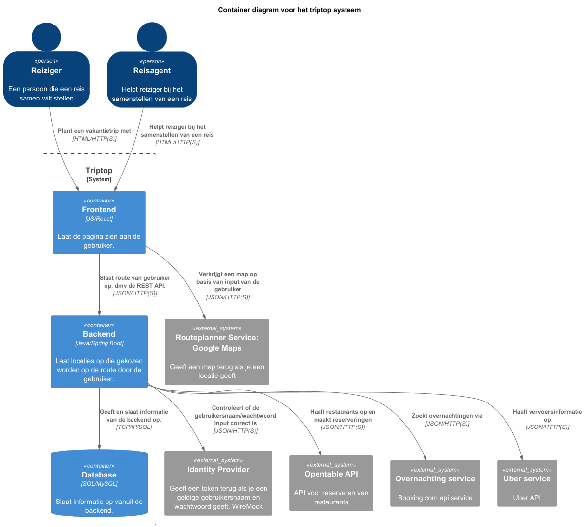

# Software Guidebook Triptop

## 1. Introduction

Dit software guidebook geeft een overzicht van de Triptop-applicatie. Het bevat een samenvatting van het volgende:

1. De vereisten, beperkingen en principes.
1. De software-architectuur, met inbegrip van de technologiekeuzes op hoog niveau en de structuur van de software.
1. De ontwerp- en codebeslissingen die zijn genomen om de software te realiseren.
1. De architectuur van de infrastructuur en hoe de software kan worden geinstalleerd.

## 2. Context

> [!IMPORTANT]
> Werk zelf dit hoofdstuk uit met context diagrammen en een beschrijving van de context van de software.

[//]: # (Toelichting op de context van de software inclusief System Context Diagram:)

[//]: # (* Functionaliteit)

[//]: # (* Gebruikers)

[//]: # (* Externe systemen)

Triptop is een online vakantieplanner waarmee reizigers zelfstandig hun vakantie kunnen samenstellen, boeken en beheren
zonder afhankelijk te zijn van een traditioneel reisbureau.

## Functionaliteit

De kernfunctionaliteiten van Triptop zijn:

* zelfstandige een vakantie samenstellen op basis van diverse variabelen (bouwstenen) zoals duurzaamheid, budget,
  reistijd etc.
* boeken en betalen van de geplande reis
* annuleren van de geboekte reis
* bewaren van de reisstatus
* flexibel uitbreiden van de bouwstenen van de reis

## Gebruikers

* Reizigers: de primaire gebruikers van Triptop zijn reizigers die zelfstandig hun vakantie willen samenstellen, boeken
  en beheren.
* Medewerkers: de secundaire gebruikers van Triptop zijn medewerkers die de reizigers ondersteunen bij het samenstellen,
  boeken en beheren van hun vakantie.

## Externe systemen:

*

## 3. Functional Overview

Om de belangrijkste features toe te lichten zijn er user stories en twee domain stories gemaakt en een overzicht van het
domein in de vorm van een domeinmodel. Op deze plek staat typisch een user story map maar die ontbreekt in dit
voorbeeld.

### 3.1 User Stories

#### 3.1.1 User Story 1: Reis plannen

Als gebruiker wil ik een zelfstandig op basis van diverse variabelen (bouwstenen) een reis kunnen plannen op basis van
mijn reisvoorkeuren (wel/niet duurzaam reizen, budget/prijsklasse, 's nachts reizen of overdag etc.) zodat ik op
vakantie kan gaan zonder dat hiervoor een reisbureau benodigd is.

#### 3.1.2 User Story 2: Reis boeken

Als gebruiker wil ik een geplande reis als geheel of per variabele (bouwsteen) boeken en betalen zodat ik op vakantie
kan gaan zonder dat hiervoor een reisbureau benodigd is.

#### 3.1.3 User Story 3: Reis cancelen

Als gebruiker wil ik een geboekte reis, of delen daarvan, kunnen annuleren zodat ik mijn geld terug kan krijgen zonder
inmenging van een intermediair zoals een reisbureau.

#### 3.1.4 User Story 4: Reisstatus bewaren

Als gebruiker wil ik mijn reisstatus kunnen bewaren zonder dat ik een extra account hoef aan te maken zodat ik mijn reis
kan volgen zonder dat ik daarvoor extra handelingen moet verrichten.

#### 3.1.5 User Story 5: Bouwstenen flexibel uitbreiden

Als gebruiker wil ik de bouwstenen van mijn reis flexibel kunnen uitbreiden met een zelf te managen stap (bijv. met
providers die niet standaard worden aangeboden zoals een andere reisorganisatie, hotelketen etc.) zodat ik mijn reis
helemaal kan aanpassen aan mijn wensen.

### 3.2 Domain Story Reis Boeken (AS IS)

### 3.3 Domain Story Reis Boeken (TO BE)

### 3.4 Domain Model

## 4. Quality Attributes

Voordat deze casusomschrijving tot stand kwam, heeft de opdrachtgever de volgende ISO 25010 kwaliteitsattributen benoemd
als belangrijk:

* Compatibility -> Interoperability (Degree to which a system, product or component can exchange information with other
  products and mutually use the information that has been exchanged)
* Reliability -> Fault Tolerance (Degree to which a system or component operates as intended despite the presence of
  hardware or software faults)
* Maintainability -> Modularity (Degree to which a system or computer program is composed of discrete components such
  that a change to one component has minimal impact on other components)
* Maintainability -> Modifiability (Degree to which a product or system can be effectively and efficiently modified
  without introducing defects or degrading existing product quality)
* Security -> Integrity (Degree to which a system, product or component ensures that the state of its system and data
  are protected from unauthorized modification or deletion either by malicious action or computer error)
* Security -> Confidentiality (Degree to which a system, product or component ensures that data are accessible only to
  those authorized to have access)

## 5. Constraints

> [!TIP]
> Beschrijf zelf de beperkingen die op voorhand bekend zijn die invloed hebben op keuzes die wel of niet gemaakt kunnen
> of mogen worden.

### 5.1. Externe API's eisen

De applicatie moet voldoen aan de functionele en technische eisen van de externe API's.

#### Impact:

* Er moet rekening gehouden worden met rate limits van bepaalde API's.
* Beschikbaarheid checken van een API (Prototypes maken).

### 5.2 Authenticatie

De applicatie moet gebruik maken van een externe authenticatie service.

#### Impact:

* De applicatie moet voldoen aan de eisen van de externe authenticatie service.

## 6. Principles

### 6.1. Architecture Principles

#### Gebruik maken van API:

Om ontwikkeltijd te besparen en onderhoud te minimaliseren, maken we gebruik van RapidAPI om externe API's te vinden en
te integreren in onze applicatie. Dit stelt ons in staat om bestaande services te benutten in plaats van deze zelf te
bouwen en onderhouden.

Er zijn hier een aantal voordelen voor:

* Snellere ontwikkeltijd
* Minder onderhoud
* Flexibiliteit in het gebruik van externe services

#### Randvoorwaarden:

* De persoonlijke API keys van RapidAPI worden niet opgeslagen in de applicatie en worden gezet in de gitignore file.
* De API keys worden in de applicatie geplaatst via een environment variabele.
* De API keys mogen niet zomaar hardcoded in de controller of iets dergelijks worden geplaatst.

### 6.2. Design Principles

> [!IMPORTANT]
> TODO

> [!TIP]
> Beschrijf zelf de belangrijkste architecturele en design principes die zijn toegepast in de software.

## 7. Software Architecture

### 7.1. Containers

> [!TODO]
> Voeg toe: Container Diagram plus een Dynamic Diagram van een aantal scenario's **inclusief begeleidende tekst** -> Moet nog.

### 7.2. Components

> [!IMPORTANT]
> Voeg toe: Component Diagram plus een Dynamic Diagram van een aantal scenario's inclusief begeleidende tekst.

### 7.3. Design & Code

> [!IMPORTANT]
> Voeg toe: Per ontwerpvraag een Class Diagram plus een Sequence Diagram van een aantal scenario's inclusief
> begeleidende tekst.

## 8. Architectural Decision Records

> [!IMPORTANT]
> Voeg toe: 3 tot 5 ADR's die beslissingen beschrijven die zijn genomen tijdens het ontwerpen en bouwen van de software.

### 8.1. ADR-001 Maps API

Datum: 2025-03-21

#### Status

Accepted

#### Context

Voor het plannen van een reis is het belangrijk om in de buurt van bepaalde locaties, interessante locaties te kunnen
vinden.
Hiervoor hebben we een Maps API nodig. Deze Maps API moet een "center point" kunnen ontvangen met een radius en een
zoekactie, waarna hij locaties geeft met een link en overige belangrijke informatie.

#### Considered Options

| Forces                        | Maps data (rapidapi) | Google Maps Places (rapidapi) |
|-------------------------------|----------------------|-------------------------------|
| Gebruik endpoint              | -                    | ++                            |
| Structuur van output          | 0                    | ++                            |
| Details van output            | -                    | ++                            |
| Rate limit bij gratis gebruik | +                    | -                             |
| Documentatie                  | ++                   | +                             |

#### Decision

Op basis van de options en de beoordeling daarop hebben we gekozen voor Google Maps Places.
Ondanks dat de Maps data betere documentatie heeft, heeft de structuur van de invoer van de gegevens en de details van
de uitvoer van Google Maps Places de doorslag gegeven.

#### Consequences

We maken gebruik van de Google Maps Places API voor het zoeken van locaties in de buurt van een bepaalde locatie.
Een nadeel hiervan is dat zonder te betalen, er een rate limit is van 100 requests per dag aan gekoppeld is.

### 8.2. ADR-002 Secret keys

Datum: 2025-03-21

#### Status

Accepted

#### Context

In deze applicatie maken we gebruik van meerdere externe services. Om deze te kunnen gebruiken zijn secret keys nodig
voor de meeste APIs.
Deze secret keys mogen niet gelekt worden aan de buitenwereld, omdat deze aan een rate limit vast zitten en in sommige
gevallen ook kosten met zich meebrengen.
Het is dus belangrijk dat deze ook niet in git terecht komen.

#### Considered Options

| Forces                     | .env | application.properties | direct in code |
|----------------------------|------|------------------------|----------------|
| Geheimhouding              | ++   | +                      | --             |
| Makkelijkheid van gebruik  | 0    | +                      | ++             |

#### Decision

We hebben gekozen voor .env. Het is misschien niet te makkelijkste keuze, maar we hebben gekozen voor geheimhouding
boven makkelijkheid van gebruik.

#### Consequences

De secret keys zullen zeer waarschijnlijk niet in git terecht komen, omdat deze veilig in de .env file staan.
We moeten wel nog uitzoeken hoe we de .env variabelen in Java krijgen, omdat we hier nog niet bekend mee zijn. Ook zal
elk teamlid individueel dit moeten instellen met hun eigen API keys.

### 8.3. ADR-003 TITLE

> [!TIP]
> These documents have names that are short noun phrases. For example, "ADR 1: Deployment on Ruby on Rails 3.0.10" or "
> ADR 9: LDAP for Multitenant Integration". The whole ADR should be one or two pages long. We will write each ADR as if it
> is a conversation with a future developer. This requires good writing style, with full sentences organized into
> paragraphs. Bullets are acceptable only for visual style, not as an excuse for writing sentence fragments. (Bullets kill
> people, even PowerPoint bullets.)

#### Context

> [!TIP]
> This section describes the forces at play, including technological, political, social, and project local. These forces
> are probably in tension, and should be called out as such. The language in this section is value-neutral. It is simply
> describing facts about the problem we're facing and points out factors to take into account or to weigh when making the
> final decision.

#### Considered Options

> [!TIP]
> This section describes the options that were considered, and gives some indication as to why the chosen option was
> selected.

#### Decision

> [!TIP]
> This section describes our response to the forces/problem. It is stated in full sentences, with active voice. "We
> will …"

#### Status

> [!TIP]
> A decision may be "proposed" if the project stakeholders haven't agreed with it yet, or "accepted" once it is agreed.
> If a later ADR changes or reverses a decision, it may be marked as "deprecated" or "superseded" with a reference to its
> replacement.

#### Consequences

> [!TIP]
> This section describes the resulting context, after applying the decision. All consequences should be listed here, not
> just the "positive" ones. A particular decision may have positive, negative, and neutral consequences, but all of them
> affect the team and project in the future.

### 8.4. ADR-004 TITLE

> [!TIP]
> These documents have names that are short noun phrases. For example, "ADR 1: Deployment on Ruby on Rails 3.0.10" or "
> ADR 9: LDAP for Multitenant Integration". The whole ADR should be one or two pages long. We will write each ADR as if it
> is a conversation with a future developer. This requires good writing style, with full sentences organized into
> paragraphs. Bullets are acceptable only for visual style, not as an excuse for writing sentence fragments. (Bullets kill
> people, even PowerPoint bullets.)

#### Context

> [!TIP]
> This section describes the forces at play, including technological, political, social, and project local. These forces
> are probably in tension, and should be called out as such. The language in this section is value-neutral. It is simply
> describing facts about the problem we're facing and points out factors to take into account or to weigh when making the
> final decision.

#### Considered Options

> [!TIP]
> This section describes the options that were considered, and gives some indication as to why the chosen option was
> selected.

#### Decision

> [!TIP]
> This section describes our response to the forces/problem. It is stated in full sentences, with active voice. "We
> will …"

#### Status

> [!TIP]
> A decision may be "proposed" if the project stakeholders haven't agreed with it yet, or "accepted" once it is agreed.
> If a later ADR changes or reverses a decision, it may be marked as "deprecated" or "superseded" with a reference to its
> replacement.

#### Consequences

> [!TIP]
> This section describes the resulting context, after applying the decision. All consequences should be listed here, not
> just the "positive" ones. A particular decision may have positive, negative, and neutral consequences, but all of them
> affect the team and project in the future.

### 8.5. ADR-005 TITLE

> [!TIP]
> These documents have names that are short noun phrases. For example, "ADR 1: Deployment on Ruby on Rails 3.0.10" or "
> ADR 9: LDAP for Multitenant Integration". The whole ADR should be one or two pages long. We will write each ADR as if it
> is a conversation with a future developer. This requires good writing style, with full sentences organized into
> paragraphs. Bullets are acceptable only for visual style, not as an excuse for writing sentence fragments. (Bullets kill
> people, even PowerPoint bullets.)

#### Context

> [!TIP]
> This section describes the forces at play, including technological, political, social, and project local. These forces
> are probably in tension, and should be called out as such. The language in this section is value-neutral. It is simply
> describing facts about the problem we're facing and points out factors to take into account or to weigh when making the
> final decision.

#### Considered Options

> [!TIP]
> This section describes the options that were considered, and gives some indication as to why the chosen option was
> selected.

#### Decision

> [!TIP]
> This section describes our response to the forces/problem. It is stated in full sentences, with active voice. "We
> will …"

#### Status

> [!TIP]
> A decision may be "proposed" if the project stakeholders haven't agreed with it yet, or "accepted" once it is agreed.
> If a later ADR changes or reverses a decision, it may be marked as "deprecated" or "superseded" with a reference to its
> replacement.

#### Consequences

> [!TIP]
> This section describes the resulting context, after applying the decision. All consequences should be listed here, not
> just the "positive" ones. A particular decision may have positive, negative, and neutral consequences, but all of them
> affect the team and project in the future.

## 9. Deployment, Operation and Support

> [!TIP]
> Zelf beschrijven van wat je moet doen om de software te installeren en te kunnen runnen.
